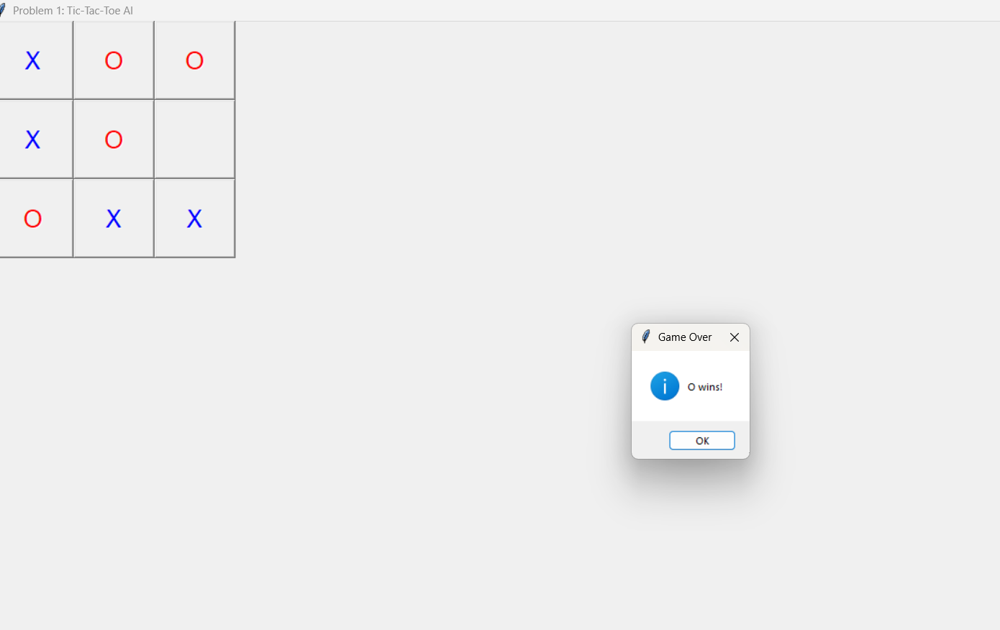
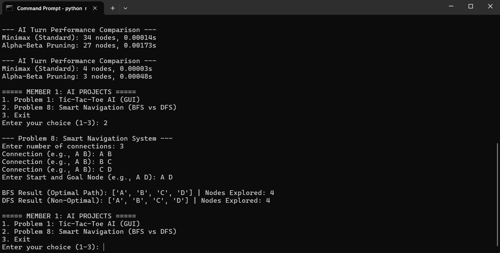
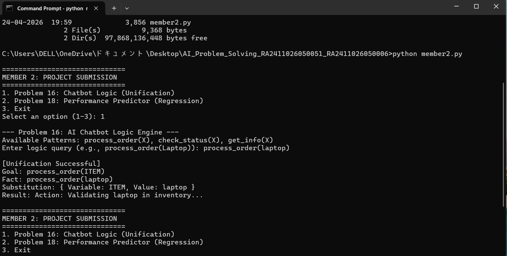
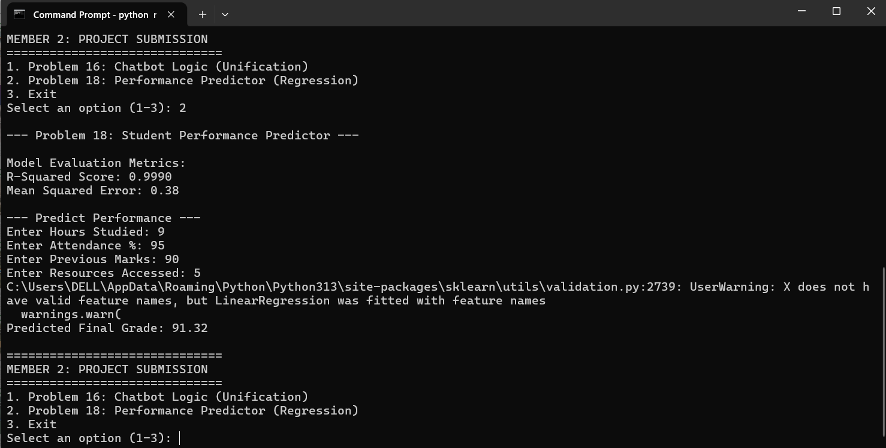

# AI Problem Solving - Project

**Course:** Artificial Intelligence  
**Deadline:** April 25, 2026  
**Team Members:**
* Siddhi Sumesh - RA2411026050051
* Anakha S Nair - RA2411026050006

---

## Project Overview
This project involves solving four distinct AI problems categorized under Game AI, Navigation Systems, Logic Engines, and Predictive Analysis. The implementation is divided between two team members.

### Member 1 Tasks (member1.py)
1. **Problem 1: Interactive Tic-Tac-Toe AI (GUI)**
   - **Algorithm:** Minimax with Alpha-Beta Pruning.
   - **Details:** Features a graphical user interface where the user plays as 'X'. The AI compares standard Minimax vs Alpha-Beta Pruning performance (nodes explored and time taken) in the console.
2. **Problem 8: Smart Navigation System**
   - **Algorithm:** Breadth-First Search (BFS) and Depth-First Search (DFS).
   - **Details:** Dynamically builds a graph from user input and compares BFS (for optimality) vs DFS (for search efficiency).

### Member 2 Tasks (member2.py)
1. **Problem 16: AI Chatbot Logic Engine**
   - **Algorithm:** Unification Algorithm.
   - **Details:** A logic-based chatbot that matches user queries (like patterns) to a knowledge base using variable substitution.
2. **Problem 18: Student Performance Predictor**
   - **Algorithm:** Linear Regression (Machine Learning).
   - **Details:** Predicts a student's final grade based on study hours, attendance, previous marks, and resources accessed.

---

## Sample Output

### Problem 1: Tic-Tac-Toe GUI & Comparison


### Problem 8: Navigation BFS vs DFS


### Problem 16: Chatbot Unification Logic


### Problem 18: Performance Prediction Regression


---

## Execution Instructions
1. **Prerequisites:** Ensure Python is installed. Install required libraries via CMD:
   ```bash
   pip install pandas scikit-learn
